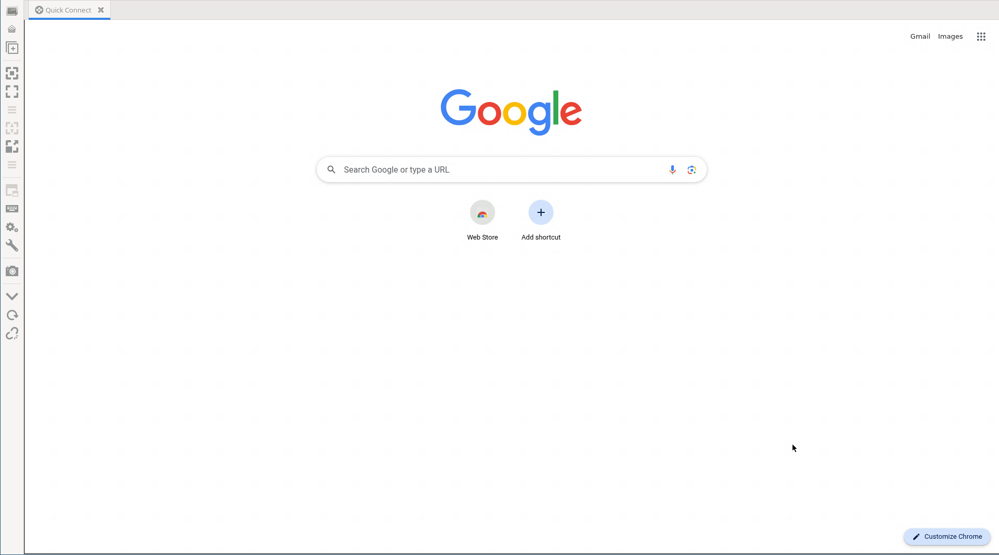

[](https://opensource.org/licenses/MIT)

# portal

_A containerized browser with remote access._

## 📌 Description

<div style="text-align: center;">
  
</div>

This project provides a containerized, remotely accessible [Google Chrome](https://www.google.com/intl/en_ca/chrome/). It runs Chrome inside a [Weston](https://wayland.pages.freedesktop.org/weston/) compositor configured for headless RDP, exposing both [RDP](https://www.freerdp.com/) access to the graphical session and [Chrome DevTools](https://chromedevtools.github.io/devtools-protocol/) over the network. The container uses [s6-overlay](https://github.com/just-containers/s6-overlay) to manage and supervise services reliably, and it’s built entirely with [Nix](https://nixos.org/) for reproducibility.

The environment inside the container is configured to closely resemble a typical host system, including setup for DBus, fonts, time zone, user accounts, and more. This makes the container a minimal yet fully functional Chrome environment, ideal for remote browsing, automation, and debugging in a controlled and consistent setting.

## 🚀 Usage

To run the containerized Chrome environment using `podman`, simply pull and start the image:

```bash
podman run --rm -it \
  -p 3389:3389 \
  -p 9222:9222 \
  ghcr.io/jovulic/portal:0.1.5
```

This will launch the container with Chrome accessible via RDP on port `3389`, and Chrome DevTools accessible on port `9222`.

### Setting the Timezone

You can set the timezone by passing the TZ environment variable when starting the container:

```bash
podman run --rm -it \
  -e TZ="America/New_York" \
  -p 3389:3389 \
  -p 9222:9222 \
  ghcr.io/jovulic/portal:0.1.5
```

### Replacing Weston Certificates

To use your own TLS certificates for Weston’s RDP server, mount them into the container at the expected paths:

```bash
podman run --rm -it \
  -v /path/to/crt.pem:/etc/xdg/weston/crt.pem:ro \
  -v /path/to/key.pem:/etc/xdg/weston/key.pem:ro \
  -p 3389:3389 \
  -p 9222:9222 \
  ghcr.io/jovulic/portal:0.1.5
```

This will override the default self-signed certificates with your own.

## 🛠️ Build

Working with this repository requires [Nix](https://nixos.org/), which handles dependency management and reproducible builds.

### Environment

A development shell is provided to encapsulate all required dependencies. You can enter it using [nix-direnv](https://github.com/nix-community/nix-direnv) for automatic activation, or manually with:

```bash
nix develop
```

### Run

To build and run the container locally, use the following command:

```bash
nix run
```

This will build the container image and start it, exposing ports:

- 3389 for RDP access
- 9222 for Chrome DevTools
